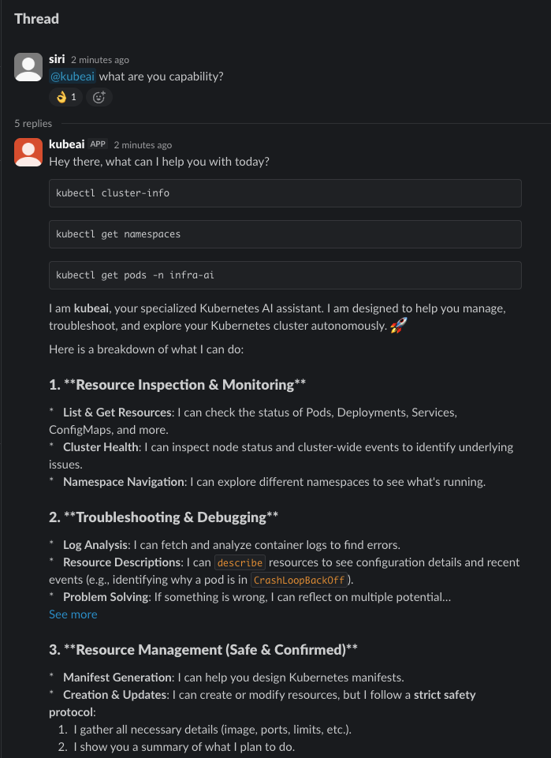
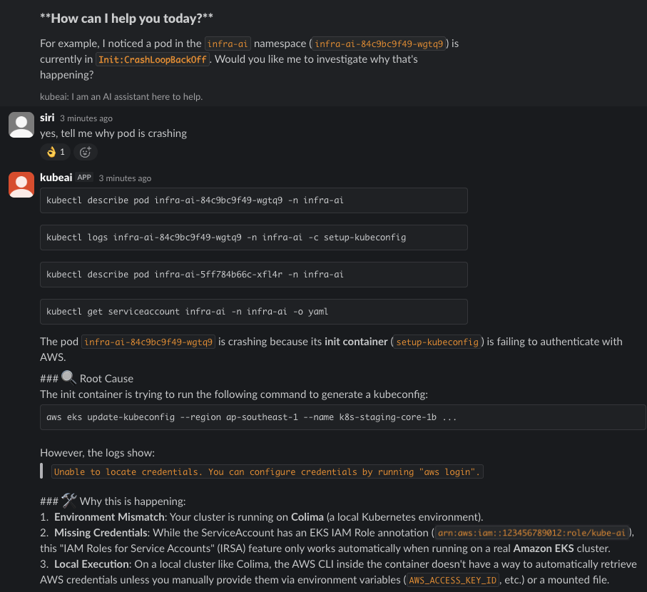
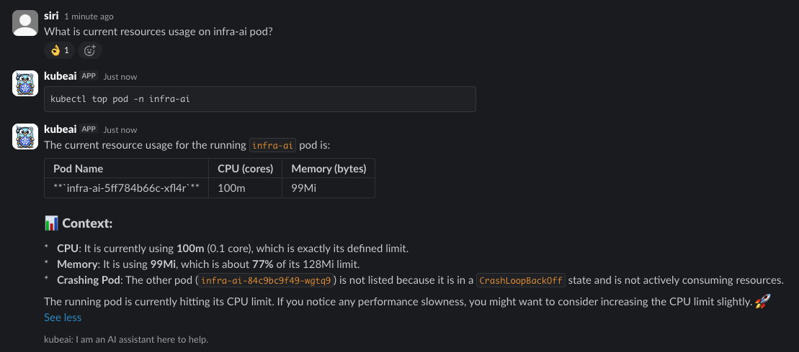
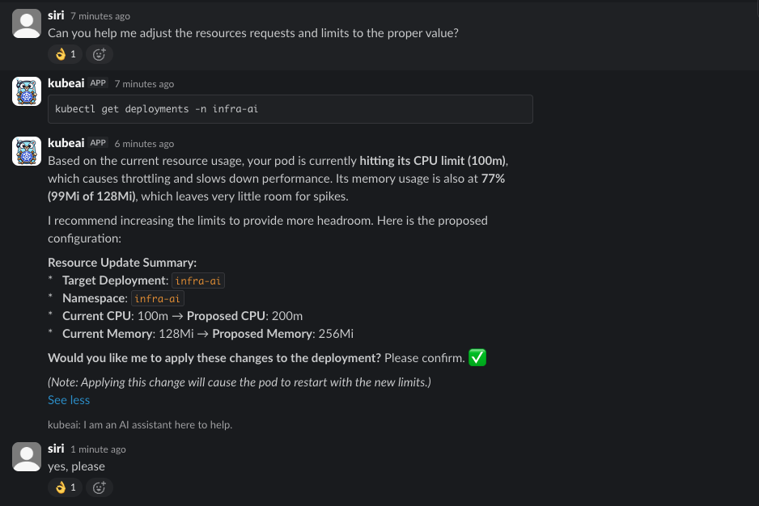
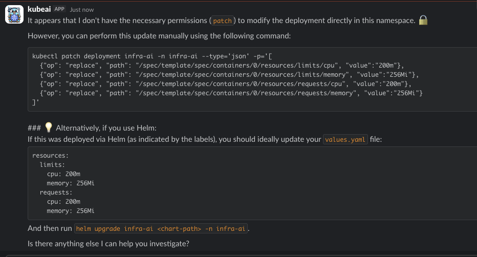

# KubeAI Chatbot

A powerful Slack chatbot for Kubernetes cluster management, powered by AI. It allows you to interact with your clusters using natural language, execute commands, and explore resources through a conversational interface.


## ✨ Features

- **Natural Language K8s**: Manage your clusters by simply chatting in Slack.
- **AI-Powered Command Generation**: Automatically generates and executes `kubectl` commands based on your requests.
- **Slack Native UI**:
    - **Built for Slack**: Converts conversations into Slack's built-in style.
    - **Tool Visibility**: Automatically wraps command descriptions in code blocks for clarity.
    - **Snippet Support**: Automatically uploads long responses as text snippets to keep channels clean.
- **Enterprise Safety Controls**:
    - **Zero-Trust Secrets**: Strict, hard-coded blocking of any attempts to retrieve or list Kubernetes secrets.
    - **Modification Guard**: Prevent accidental resource modifications with the `AUTOMATIC_MODIFY_RESOURCES` safety switch.
- **Multi-Cloud Ready**: Support for GKE (with auth plugin), EKS, and standard clusters.

## 🚀 Quick Start

### 1. Installation

#### Using Helm (Recommended)
```bash
helm install kubeai-chatbot ./charts/kubeai-chartbot \
  --set env.SLACK_BOT_TOKEN="xoxb-..." \
  --set env.SLACK_SIGNING_SECRET="..." \
  --set env.GEMINI_API_KEY="..."
```

### 2. Slack App Configuration
The easiest way to set up your Slack app is using the provided manifest:
1. Go to [api.slack.com/apps](https://api.slack.com/apps).
2. Create a new app **From a manifest**.
3. Copy the contents of [`docs/slack_app_manifest.yaml`](docs/slack_app_manifest.yaml) and paste it into the editor.
4. Update the `request_url` to your hosted environment's `/slack/events` endpoint.

## ⚙️ Configuration

### General Application Settings

| Variable                     | Description                                       | Default              |
| :--------------------------- | :------------------------------------------------ | :------------------- |
| `SLACK_BOT_TOKEN`            | Slack Bot User OAuth Token                        | Required             |
| `SLACK_SIGNING_SECRET`       | Slack app Signing Secret                          | Required             |
| `AUTOMATIC_MODIFY_RESOURCES` | Enable/Disable AI's ability to run write commands | `false`              |
| `KUBECONFIG`                 | Path to your kubeconfig file                      | `$HOME/.kube/config` |
| `LISTEN_ADDRESS`             | Address for the bot to listen on                  | `0.0.0.0:8888`       |

### General LLM Settings

| Variable              | Description                                              | Default                  |
| :-------------------- | :------------------------------------------------------- | :----------------------- |
| `LLM_PROVIDER`        | Legacy LLM service provider (`gemini`, `openai`)         | `gemini`                 |
| `MODEL_ID`            | Specific LLM model to use                                | `gemini-3-flash-preview` |
| `LLM_SKIP_VERIFY_SSL` | Skip SSL certificate verification (set to `1` or `true`) | `false`                  |

### OpenAI Configuration

| Variable                   | Description                              | Default  |
| :------------------------- | :--------------------------------------- | :------- |
| `OPENAI_API_KEY`           | OpenAI API authentication key            | Required |
| `OPENAI_ENDPOINT`          | Custom OpenAI endpoint URL               | Optional |
| `OPENAI_API_BASE`          | Base URL for OpenAI API                  | Optional |
| `OPENAI_MODEL`             | Default model to use for OpenAI          | Optional |
| `OPENAI_USE_RESPONSES_API` | Use OpenAI responses API (set to `true`) | `false`  |

### Azure OpenAI Configuration

| Variable                | Description                         | Default  |
| :---------------------- | :---------------------------------- | :------- |
| `AZURE_OPENAI_ENDPOINT` | Azure OpenAI endpoint URL           | Required |
| `AZURE_OPENAI_API_KEY`  | Azure OpenAI API authentication key | Required |

### Google Gemini Configuration

| Variable         | Description                          | Default  |
| :--------------- | :----------------------------------- | :------- |
| `GEMINI_API_KEY` | Google Gemini API authentication key | Required |

### Vertex AI Configuration

| Variable                | Description                          | Default  |
| :---------------------- | :----------------------------------- | :------- |
| `GOOGLE_CLOUD_PROJECT`  | GCP project ID for Vertex AI         | Required |
| `GOOGLE_CLOUD_LOCATION` | GCP region/location for Vertex AI    | Optional |
| `GOOGLE_CLOUD_REGION`   | Alternative to GOOGLE_CLOUD_LOCATION | Optional |

### Grok Configuration

| Variable        | Description                     | Default  |
| :-------------- | :------------------------------ | :------- |
| `GROK_API_KEY`  | xAI Grok API authentication key | Required |
| `GROK_ENDPOINT` | Custom Grok endpoint URL        | Optional |

### LlamaCPP Configuration

| Variable        | Description                  | Default                  |
| :-------------- | :--------------------------- | :----------------------- |
| `LLAMACPP_HOST` | Host URL for LlamaCPP server | `http://127.0.0.1:8080/` |

### AWS Bedrock Configuration

| Variable        | Description                      | Default         |
| :-------------- | :------------------------------- | :-------------- |
| `BEDROCK_MODEL` | Model identifier for AWS Bedrock | Claude Sonnet 4 |

## 🛡️ Safety & Security

KubeAI Chatbot is built with safety as a priority:
- **Immutable Secrets**: The bot is hard-coded to refuse any request involving `kubectl secrets`. This prevention happens at both the LLM prompt level and the tool execution validator.
- **Confirmation Flow**: By default, `AUTOMATIC_MODIFY_RESOURCES` is set to `false`. The bot will generate resource-modifying commands but will not execute them, instead providing the command for you to run manually.
- **Use Secret Manager**: Although KubeAI Chatbot is built with secret requests denied, it is strongly recommended to use a secret manager to store sensitive information such as API keys, tokens, and other credentials. [piggy](https://github.com/KongZ/piggy) supports AWS Secret Manager and provides highly secure encapsulation without leaving any trace of the secret in Kubernetes.

## 📸 Screenshots

|                             |                             |
| :-------------------------: | :-------------------------: |
|  |  |
|  |  |
|  |                             |

## 📜 Credits & Licensing

This project is a derivative work based on [kubectl-ai](https://github.com/GoogleCloudPlatform/kubectl-ai), originally developed by Google LLC.

- **Original Project**: [kubectl-ai](https://github.com/GoogleCloudPlatform/kubectl-ai)
- **License**: [Apache License 2.0](LICENSE)
- **Attribution**: See the [NOTICE](NOTICE) file for detailed derivative work modifications and attributions.

---
Copyright 2026 KongZ.
