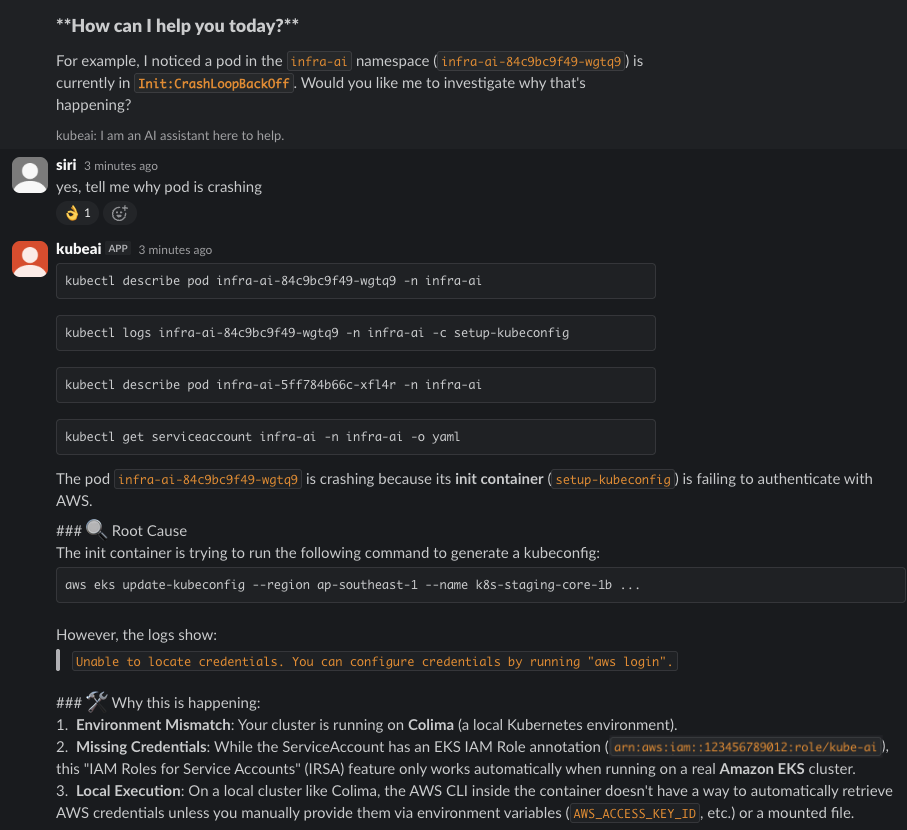

# KubeAI Chatbot

A powerful Slack chatbot for Kubernetes cluster management, powered by AI. It allows you to interact with your clusters using natural language, execute commands, and explore resources through a conversational interface.


## 💡 Why use KubeAI?

In many organizations, DevOps teams often become a bottleneck for developers who need to understand why their services aren't deploying correctly or why pods are crashing. Even when engineering teams have cluster access, the steep learning curve of Kubernetes can be daunting.

KubeAI Chatbot addresses these pain points by:

  - **Empowering Developers**: Acting as an "on-demand DevOps partner" in Slack, helping teams troubleshoot and learn Kubernetes in real-time.
  - **Reducing DevOps Fatigue**: Handling routine status checks and diagnostic questions, allowing DevOps engineers to focus on higher-value infrastructure work.
  - **Bridging the Knowledge Gap**: Translating complex Kubernetes states into understandable natural language and actionable insights.



## ✨ Features

  - **Natural Language K8s**: Manage your clusters by simply chatting in Slack.
  - **AI-Powered Command Generation**: Automatically generates and executes `kubectl` commands based on your requests.
  - **Slack Native UI**:
    - **Built for Slack**: Converts conversations into Slack's built-in style.
    - **Tool Visibility**: Automatically wraps command descriptions in code blocks for clarity.
    - **Snippet Support**: Automatically uploads long responses as text snippets to keep channels clean.
  - **Enterprise Safety Controls**:
    - **Zero-Trust Secrets**: Strict, hardcoded blocking of any attempts to retrieve or list Kubernetes secrets.
    - **Modification Guard**: Three-tier `MODIFY_RESOURCES` control — `none` (read-only), `allow` (confirm before write), or `auto` (fully autonomous writes).
  - **Multi-Cloud Ready**: Support for GKE (with auth plugin), EKS, and standard clusters.

## 🚀 Quick Start

### 1. Installation

#### Using Helm (Recommended)

```bash
helm install kubeai-chatbot ./charts/kubeai-chartbot \
  --set env.SLACK_BOT_TOKEN="xoxb-..." \
  --set env.SLACK_SIGNING_SECRET="..." \
  --set env.GEMINI_API_KEY="..."
```

### 2. Slack App Configuration

The easiest way to set up your Slack app is using the provided manifest:

  1. Go to [api.slack.com/apps](https://api.slack.com/apps).
  2. Create a new app **From a manifest**.
  3. Copy the contents of [`docs/slack_app_manifest.yaml`](docs/slack_app_manifest.yaml) and paste it into the editor.
  4. Update the `request_url` to your hosted environment's `/slack/events` endpoint.

## ⚙️ Configuration

### General Application Settings

| Variable               | Description                                                                                                   | Default              |
| :--------------------- | :------------------------------------------------------------------------------------------------------------ | :------------------- |
| `SLACK_BOT_TOKEN`      | Slack Bot User OAuth Token                                                                                    | Required             |
| `SLACK_SIGNING_SECRET` | Slack app Signing Secret                                                                                      | Required             |
| `MODIFY_RESOURCES`     | Resource modification mode: `none`, `allow`, or `auto` (see [Modification Modes](docs/modification_modes.md)) | `none`               |
| `KUBECONFIG`           | Path to your kubeconfig file                                                                                  | `$HOME/.kube/config` |
| `LISTEN_ADDRESS`       | Address for the bot to listen on                                                                              | `0.0.0.0:8888`       |
| `AUTH_METHOD`          | Auth method (`SAML`, `OIDC`, or `NONE`)                                                                       | `NONE`               |
| `SESSION_TYPE`         | Session storage (`postgres`, `filesystem`, `memory`)                                                                | `memory`             |
| `LOG_LEVEL`            | Verbosity of logs (e.g., `2` for info)                                                                        | `1`                  |

### General LLM Settings

| Variable                | Description                                                                                                                                                        | Default                  |
| :---------------------- | :----------------------------------------------------------------------------------------------------------------------------------------------------------------- | :----------------------- |
| `LLM_PROVIDER`          | Legacy LLM service provider (`gemini`, `openai`)                                                                                                                   | `gemini`                 |
| `MODEL_ID`              | Specific LLM model to use                                                                                                                                          | `gemini-3-flash-preview` |
| `LLM_SKIP_VERIFY_SSL`   | Skip SSL certificate verification (set to `1` or `true`)                                                                                                           | `false`                  |
| `LLM_MAX_HISTORY_ITEMS` | Maximum number of conversation history entries sent per request. `0` disables the limit. See [Context Management](docs/context_management.md) for sizing guidance. | `0` (unlimited)          |

### OpenAI Configuration

| Variable                   | Description                              | Default  |
| :------------------------- | :--------------------------------------- | :------- |
| `OPENAI_API_KEY`           | OpenAI API authentication key            | Required |
| `OPENAI_ENDPOINT`          | Custom OpenAI endpoint URL               | Optional |
| `OPENAI_API_BASE`          | Base URL for OpenAI API                  | Optional |
| `OPENAI_MODEL`             | Default model to use for OpenAI          | Optional |
| `OPENAI_USE_RESPONSES_API` | Use OpenAI responses API (set to `true`) | `false`  |

### Azure OpenAI Configuration

| Variable                | Description                         | Default  |
| :---------------------- | :---------------------------------- | :------- |
| `AZURE_OPENAI_ENDPOINT` | Azure OpenAI endpoint URL           | Required |
| `AZURE_OPENAI_API_KEY`  | Azure OpenAI API authentication key | Required |

### Google Gemini Configuration

| Variable         | Description                          | Default  |
| :--------------- | :----------------------------------- | :------- |
| `GEMINI_API_KEY` | Google Gemini API authentication key | Required |

### Vertex AI Configuration

| Variable                | Description                          | Default  |
| :---------------------- | :----------------------------------- | :------- |
| `GOOGLE_CLOUD_PROJECT`  | GCP project ID for Vertex AI         | Required |
| `GOOGLE_CLOUD_LOCATION` | GCP region/location for Vertex AI    | Optional |
| `GOOGLE_CLOUD_REGION`   | Alternative to GOOGLE_CLOUD_LOCATION | Optional |

### Grok Configuration

| Variable        | Description                     | Default  |
| :-------------- | :------------------------------ | :------- |
| `GROK_API_KEY`  | xAI Grok API authentication key | Required |
| `GROK_ENDPOINT` | Custom Grok endpoint URL        | Optional |

### LlamaCPP Configuration

| Variable        | Description                  | Default                  |
| :-------------- | :--------------------------- | :----------------------- |
| `LLAMACPP_HOST` | Host URL for LlamaCPP server | `http://127.0.0.1:8080/` |

### AWS Bedrock Configuration

| Variable        | Description                      | Default         |
| :-------------- | :------------------------------- | :-------------- |
| `BEDROCK_MODEL` | Model identifier for AWS Bedrock | Claude Sonnet 4 |

## 🔐 Authentication

KubeAI Chatbot supports optional enterprise-grade authentication. When enabled, it provides:

  - **Identity-First Access**: Users must authenticate via your IdP (Identity Provider) before using the chatbot.
  - **Kube-Native RBAC**: Sessions are mapped to Kubernetes identities, allowing the bot to perform actions using **client impersonation** (RBAC).

For detailed setup instructions, see:

  - [SAML 2.0 Setup Guide](docs/auth_saml.md)
  - [OIDC Setup Guide](docs/auth_oidc.md)
  - [Architecture & Auth Flows](docs/architecture.md#authentication-flow-samloidc)

## 🛡️ Safety & Security

KubeAI Chatbot is built with safety as a priority:

  - **Immutable Secrets**: The bot is hardcoded to refuse any request involving `kubectl secrets`. This prevention happens at both the LLM prompt level and the tool execution validator.
  - **Modification Modes**: The `MODIFY_RESOURCES` env var controls write access with three levels: `none` (read-only — bot provides commands for you to run manually), `allow` (bot can execute writes only after you say yes), and `auto` (bot executes writes autonomously). Default is `none`. See [Modification Modes](docs/modification_modes.md) for details.
  - **Use Secret Manager**: Although KubeAI Chatbot is built with secret requests denied, it is strongly recommended to use a secret manager to store sensitive information such as API keys, tokens, and other credentials. [piggy](https://github.com/KongZ/piggy) supports AWS Secret Manager and provides highly secure encapsulation without leaving any trace of the secret in Kubernetes.

## 🏗️ Architecture

  - [System Architecture](docs/architecture.md)
  - [Modification Modes](docs/modification_modes.md)
  - [Context Management](docs/context_management.md)
  - [Session Storage Setup](docs/session_storage.md)
  - [SAML Authentication Setup](docs/auth_saml.md)
  - [OIDC Authentication Setup](docs/auth_oidc.md)
  - [Cross-Cluster Access Setup](docs/cross_cluster_access.md)

## 📜 Credits & Licensing

This project is a derivative work based on [kubectl-ai](https://github.com/GoogleCloudPlatform/kubectl-ai), originally developed by Google LLC.

  - **Original Project**: [kubectl-ai](https://github.com/GoogleCloudPlatform/kubectl-ai)
  - **License**: [Apache License 2.0](LICENSE)
  - **Attribution**: See the [NOTICE](NOTICE) file for detailed derivative work modifications and attributions.

---
Copyright 2026 KongZ.
