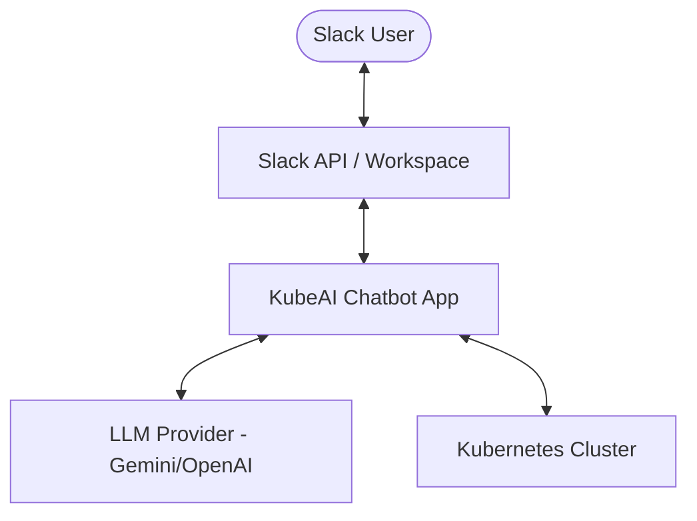
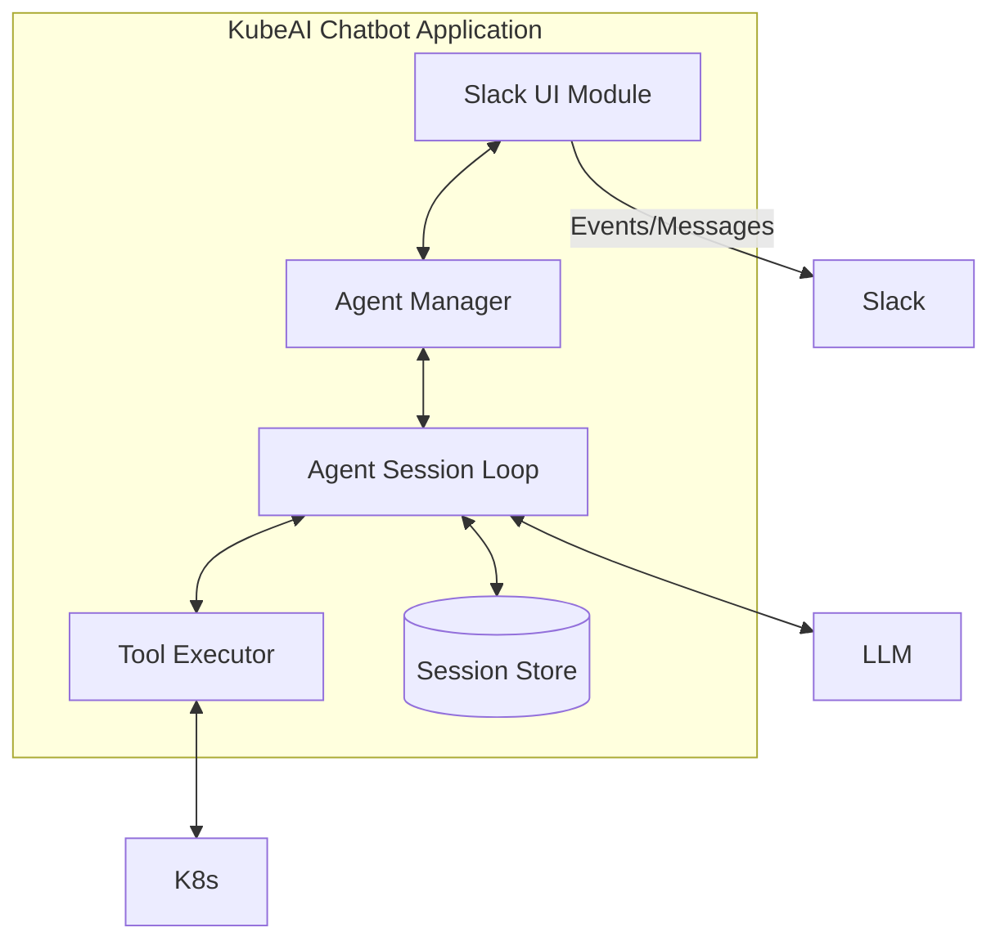
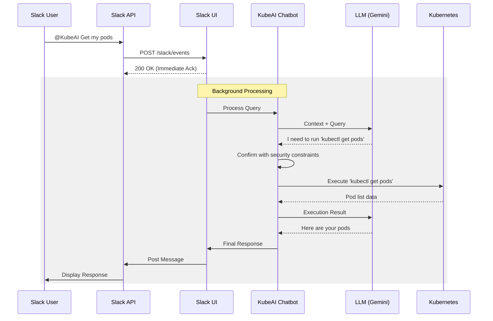

# System Architecture

KubeAI Chatbot is designed as a standalone Go application that bridges Slack conversations with Kubernetes cluster management using Large Language Models (LLMs).

## Component Overview

The following diagram illustrates the high-level components and their interactions:

## Internal Architecture

The application is organized into several key modules:

### Core Modules

1. **Slack UI (`pkg/ui/slack`)**:
  * Handles incoming Slack events (mentions, messages).
  * Manages event de-duplication and immediate acknowledgment.
  * Transforms Markdown responses into Slack-native **Blocks** (including native TableBlocks).
  * Handles long responses by uploading snippets.

2. **Agent Manager (`pkg/agent`)**:
  * Orchestrates the lifecycle of AI Agents.
  * Maps Slack channels and thread timestamps to persistent session IDs.
  * Ensures clean startup and shutdown of agent loops.
  * Maintains the state machine for a single conversation.
  * Interacts with the LLM to process queries and determine tool usage.
  * Enforces safety rules (e.g., preventing secret retrieval or unauthorized modifications).

3. **Tool Executor (`pkg/tools`)**:
  * Wrapper around `kubectl` and other potential utilities.
  * Validates commands before execution for security and correctness.

4. **Session Store (`pkg/sessions`)**:
  * Provides persistence for session metadata using the local filesystem or memory.

5. **Journal (`pkg/journal`)**:
  * Provides journaling for chat history using the local filesystem or standard output.

## Request Flow

When a user mentions the bot in Slack, the following sequence occurs:

