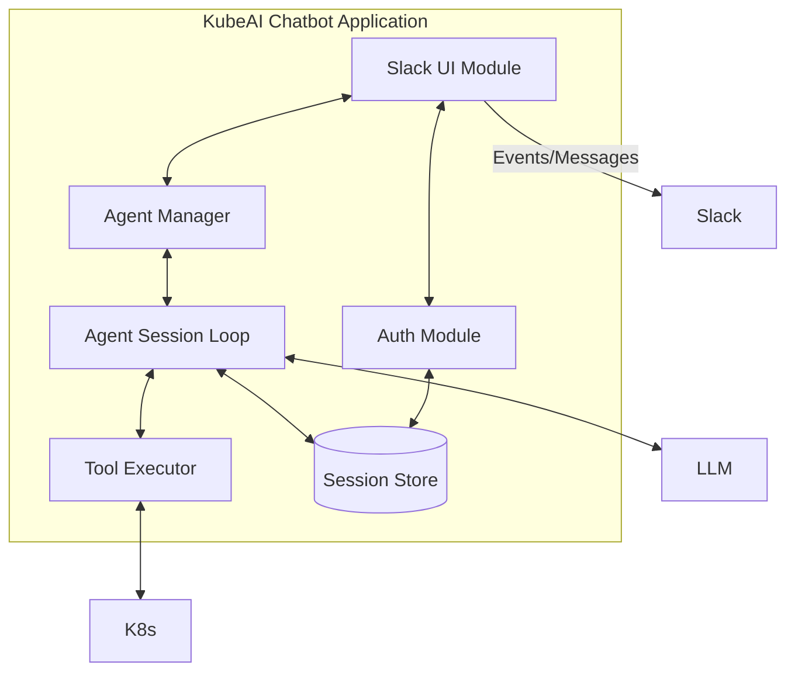
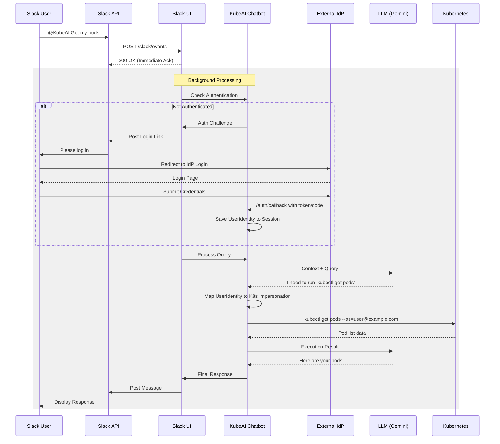

# System Architecture

KubeAI Chatbot is designed as a standalone Go application that bridges Slack conversations with Kubernetes cluster management using Large Language Models (LLMs).

## Component Overview

The following diagram illustrates the high-level components and their interactions:

## Internal Architecture

The application is organized into several key modules:

### Core Modules

1. **Slack UI (`pkg/ui/slack`)**:

  * Handles incoming Slack events (mentions, messages).
  * Manages event de-duplication and immediate acknowledgment.
  * Transforms Markdown responses into Slack-native **Blocks** (including native TableBlocks).
  * Handles long responses by uploading snippets.

2. **Agent Manager (`pkg/agent`)**:

  * Orchestrates the lifecycle of AI Agents.
  * Maps Slack channels and thread timestamps to persistent session IDs.
  * Ensures clean startup and shutdown of agent loops.
  * Maintains the state machine for a single conversation.
  * Interacts with the LLM to process queries and determine tool usage.
  * Enforces safety rules (e.g., preventing secret retrieval or unauthorized modifications).

3. **Tool Executor (`pkg/tools`)**:

  * Wrapper around `kubectl` and other potential utilities.
  * Validates commands before execution for security and correctness.

4. **Session Store (`pkg/sessions`)**:

  * Provides persistence for session metadata and user identity.
  * Supports multiple backends: **PostgreSQL**, **Filesystem**, and **In-Memory**.

5. **Auth Module (`pkg/auth`)**:

  * Implements SAML 2.0 and OIDC (OpenID Connect) service provider logic.
  * Maps external identities (e.g., groups, roles) to Kubernetes roles and subjects.
  * Handles authentication challenges and secure callbacks.

6. **Journal (`pkg/journal`)**:

  * Provides journaling for chat history using the local filesystem or standard output.

## Request Flow

When a user mentions the bot in Slack, the following sequence occurs:

## Session Management

KubeAI Chatbot maintains persistent state for every Slack thread to enable contextual multi-turn conversations and secure authentication.

### What is a Session?

A session is an object that encapsulates the state of a conversation between a Slack user (in a specific channel/thread) and the AI agent. It is identified by a unique `SessionID`.

### Data Stored in Session

| Field            | Description                                                      |
| :--------------- | :--------------------------------------------------------------- |
| **SessionID**    | Unique identifier (derived from Slack thread TS or UUID).        |
| **UserIdentity** | Authenticated user information (UserID, Role, Groups, Metadata). |
| **Environment**  | Custom environment variables for tool execution.                 |
| **CreatedAt**    | Timestamp of session initiation.                                 |
| **LastActive**   | Timestamp of last user interaction.                              |

### Supporting Session Types

The `pkg/sessions` package provides an abstraction layer for various storage backends:

1. **Memory (`memory`)**:

  * Volatile storage used for development or transient deployments.
  * State is lost when the application restarts.

2. **Filesystem (`file`)**:

  * JSON-based persistence on the local disk.
  * Suitable for single-node deployments without external database requirements.

3. **PostgreSQL (`postgres`)**:

  * Production-ready persistence using a relational database.
  * Supports high availability and data durability.
  * Automatic schema migrations are handled on startup.

### Authentication Flow (SAML/OIDC)

> [!NOTE]
> Authentication is **optional**. It is only enabled when the `AUTH_METHOD` environment variable is explicitly set to `SAML` or `OIDC`. If it is unset or set to `NONE`, the chatbot operates without an authentication layer.

When `AUTH_METHOD` is set to `SAML` or `OIDC`:

1. **Challenge**: Incoming requests from unauthenticated users trigger a Slack message with a one-time login link.
2. **Redirection**: The link directs the user to the chatbot's `/saml/login` or OIDC auth endpoint.
3. **Authentication**: After successful IdP login, the user is redirected back to `/auth/callback` (OIDC) or `/saml/acs` (SAML).
4. **Identity Mapping**: The chatbot extracts attributes (e.g., `roles`, `groups`) and stores an `api.Identity` object in the user's session.
5. **Impersonation**: Subsequent tool calls use the stored identity to perform Kubernetes impersonation via `--as` flags.
